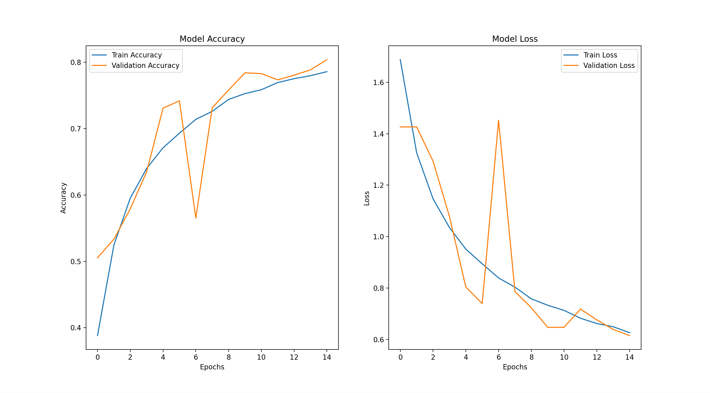
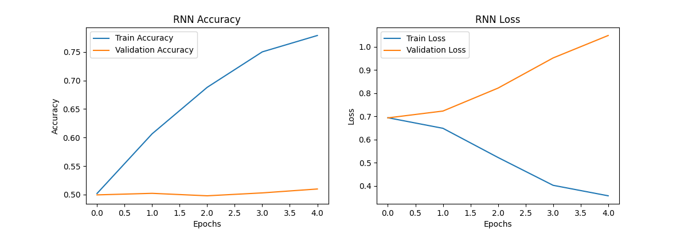

<h1 align="center" style="color:#7B61FF;">
🧠 Deep Learning Models using Python
</h1>

CNN • RNN • LSTM • Bidirectional LSTM

A structured, runnable Deep Learning repository focused on
<strong>implementation, experimentation, and engineering discipline</strong>.

<h2 align="center">📌 Overview</h2>

This repository contains <strong>four core Deep Learning models</strong> implemented using
<strong>Python and TensorFlow</strong>, covering major problem domains:

🖼️ Image Classification &nbsp; | &nbsp;
📝 Natural Language Processing &nbsp; | &nbsp;
📈 Time Series Forecasting &nbsp; | &nbsp;
📊 Financial Prediction

Each model is designed to be:
  
✔ Runnable from a single entry point (<code>main.py</code>) 
✔ Modular and reusable 
✔ Backed by saved results (plots & models) 
✔ Easy for recruiters and learners to understand

<h2 align="center">🗂️ Project Structure</h2>

<pre align="center">
Deep_Learning/
│
├── main.py                  # Entry point to run all models
├── requirements.txt         # Required dependencies
├── README.md                # Documentation
│
├── models/                  # Final Deep Learning models
│   ├── __init__.py
│   ├── cnn.py
│   ├── rnn.py
│   ├── lstm.py
│   └── bidirectional_lstm.py
│
├── notebooks/               # Jupyter notebooks (experiments)
│
├── data/                    # Datasets (e.g., Apple.csv)
│
└── outputs/                 # Saved models & result plots
</pre>

<h2 align="center">🚀 Models Implemented</h2>

 

<h3 align="center">🖼️ 1. Convolutional Neural Network (CNN)</h3>

<strong>Task:</strong> Image Classification (CIFAR-10) 
<strong>Concepts:</strong> Convolution, Pooling, Batch Normalization, Dropout

✔ Data Augmentation 
✔ Regularization using Dropout 
✔ Training & Validation Accuracy/Loss 
✔ Saved trained model

<h3 align="center">📝 2. Recurrent Neural Network (RNN)</h3>

<strong>Task:</strong> IMDB Movie Review Sentiment Analysis 
<strong>Concepts:</strong> Embeddings, Sequential Text Modeling

✔ Text preprocessing & padding 
✔ Binary classification (positive / negative) 
✔ Accuracy & Loss tracking 
✔ Saved trained model

<h3 align="center">📈 3. Long Short-Term Memory (LSTM)</h3>

<strong>Task:</strong> Multi-step Time Series Prediction 
<strong>Concepts:</strong> Sequence learning, Temporal dependencies

✔ Synthetic time-series data 
✔ Multi-step forecasting 
✔ Training loss visualization 
✔ Prediction visualization

<h3 align="center">📊 4. Bidirectional LSTM (Bi-LSTM)</h3>

<strong>Task:</strong> Stock Price Prediction (NFLX / Apple) 
<strong>Concepts:</strong> Bidirectional sequence learning, real-world data handling

✔ Real financial dataset 
✔ Proper scaling (no data leakage) 
✔ Early stopping 
✔ Prediction vs actual price visualization

<h2 align="center">▶️ How to Run</h2>

<strong>1️⃣ Clone the repository</strong>  
<code>git clone https://github.com/Adarshkumar61/Deep_Learning.git</code>

<strong>2️⃣ Install dependencies</strong>  
<code>pip install -r requirements.txt</code>

<strong>3️⃣ Run the main program</strong>  
<code>python main.py</code>

Select a model from the menu and it will execute automatically.

<h2 align="center">📊 Results & Observations</h2>

✔ CNN performs well with data augmentation but can overfit without regularization  
✔ Simple RNN works for short sequences but struggles with long dependencies  
✔ LSTM improves stability in time-series prediction  
✔ Bidirectional LSTM captures richer temporal patterns but increases computation cost

<h2 align="center">🧠 Key Learning Outcomes</h2>

✔ Understanding Deep Learning across multiple domains  
✔ Writing modular, reusable ML code  
✔ Proper dataset handling & preprocessing  
✔ Avoiding common ML mistakes (data leakage, wrong splits)  
✔ Saving and analyzing training results

<h2 align="center">🔮 Future Improvements</h2>

🚀 Replace Simple RNN with GRU & Attention  
🧠 Implement Transformer-based models  
📊 Add more evaluation metrics (RMSE, Precision/Recall)  
☁️ Deploy trained models using APIs or dashboards  
🤖 Integrate Deep Learning models with Robotics & Vision systems

<h2 align="center">👨‍💻 Author</h2>

<strong>Adarsh Kumar</strong>  
🎓 BCA Student | 🤖 Robotics • AI • Deep Learning Enthusiast  
🔗 <a href="https://github.com/Adarshkumar61">GitHub Profile</a>

